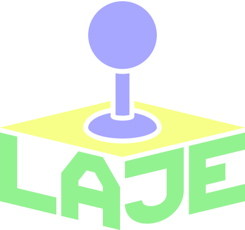

# LAJE
### Liga Acadêmica de Jogos Eletrônicos • CIn / UFPE

**Fazemos jogos do primeiro rabisco ao botão de *Play*.**

<!--

-->

---

## ▶️ Press Start

Somos uma liga estudantil do **Centro de Informática da UFPE**. Tudo começou com uma ideia simples: se a gente gosta tanto de jogar, por que não fazer os nossos jogos?

Hoje, a LAJE reúne programadores, artistas 2D e 3D, game designers, roteiristas e compositores. Nós nos organizamos em equipes, e cada uma leva seu projeto do rascunho até a publicação, com prazos, revisões e entregas de verdade. O que nos une é a paixão por games, e é ela que nos faz cuidar de cada detalhe, do *level design* ao *game feel*.

Nosso método é jogar cedo, quebrar, consertar e jogar de novo.

---

## 🧙 Escolha sua classe

Toda *party* precisa de classes e especialidades diferentes. Na LAJE, a nossa é assim:

| | Classe | Habilidades |
|---|---|---|
| 💻 | **Programação** | Mecânicas de gameplay, inteligência artificial, física, shaders (HLSL/GLSL), otimização e versionamento com Git & Git LFS |
| 🎨 | **Arte, 3D & Animação** | Pixel art, arte conceitual, modelagem low/high-poly, rigging, animação quadro a quadro, iluminação estilizada e UI/UX |
| 🧩 | **Game Design & Narrativa** | GDDs, level design guiado por ritmo e curva de aprendizado, worldbuilding autoral |
| 🎧 | **Áudio & Música** | Efeitos sonoros (SFX) e trilhas originais (OST) |

---

## 🗺️ Fases do jogo

**Fase 1: Projetos autorais.** Cada equipe desenvolve o seu jogo, do protótipo ao lançamento.

**Fase 2: Game jams.** A **Lajam**, nossa primeira edição, aconteceu em janeiro de 2026 e inaugurou um calendário de eventos em que se cria um jogo em pouco tempo.

**Fase 3: Ferramentas e experimentos.** Protótipos e pipelines que surgem das necessidades dos próprios projetos.

**Fase 4: Troca de conhecimento.** Workshops, mentorias internas e conversas entre membros com diferentes níveis de experiência.

---

## 🎒 Inventário

Nossas mochilas contêm as ferramentas que mais usamos.

| | |
|---|---|
| **Engines** | Unreal Engine 5, Unity e Godot |
| **Linguagens** | C++, C#, GDScript, Python e TypeScript |
| **Criação & Arte** | Blender, Aseprite, Photoshop e Figma |
| **Colaboração** | Desenvolvimento ágil, código colaborativo e autogerenciamento |

---

## 👾 Jogue agora

Os **Repositórios em Destaque** deste perfil reúnem o código, as ferramentas e os jogos das nossas equipes.

Parte deles pode ser jogada no navegador ou baixada no **[Itch.io](https://itch.io)** e no **[Portal da LAJE](https://laje-cin.vercel.app/)**. Quando jogar, conte para a gente o que achou.

<!--
Sugestão: adicionar aqui 3 a 5 projetos com capa/GIF, uma linha de descrição, engine usada, tamanho da equipe e link para jogar. Exemplo:

### Nome do Jogo
*Gênero • Engine • Equipe de N pessoas*
Uma frase objetiva sobre o jogo.
[Jogar](#) • [Repositório](#)
-->

---

## 🎮 Join as Player 2

Se você faz parte de uma empresa, de um estúdio ou de outra comunidade, ou se só tem uma ideia boa e quer trocar uma conversa, a LAJE tem espaço. Algumas formas de jogar junto:

* **Apoiar nossos eventos:** patrocinar ou propor temas e desafios para as game jams.
* **Compartilhar experiência:** dar uma palestra ou um workshop sobre o seu trabalho e o mercado.
* **Construir algo com a gente:** propor um desafio técnico, acompanhar um protótipo ou desenvolver um projeto em parceria.
* **Conhecer nossa equipe:** se você busca estagiários, juniores ou freelancers, fale com a gente e apresentaremos quem combina com a oportunidade.

> 📩 Escreva para **[laje@cin.ufpe.br](mailto:laje@cin.ufpe.br)** ou chame a gente no **[LinkedIn](https://www.linkedin.com/company/laje-ufpe/)**.

---

## 🏛️ Créditos

A LAJE integra o **Centro de Informática (CIn) da Universidade Federal de Pernambuco (UFPE)**.

**Professores orientadores:** Prof. Geber Ramalho e Prof. Giordano Cabral

© LAJE • Liga Acadêmica de Jogos Eletrônicos — CIn / UFPE

